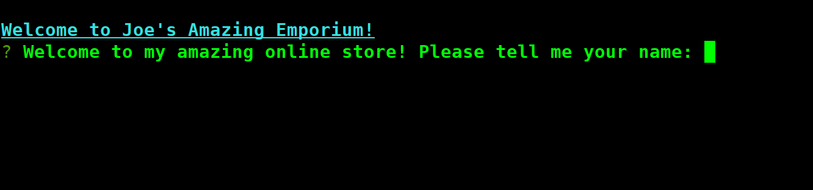
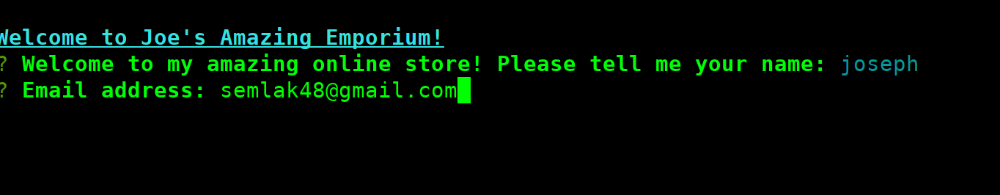
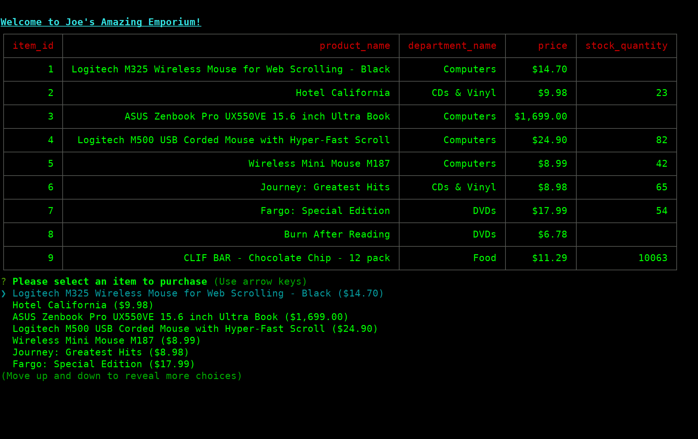
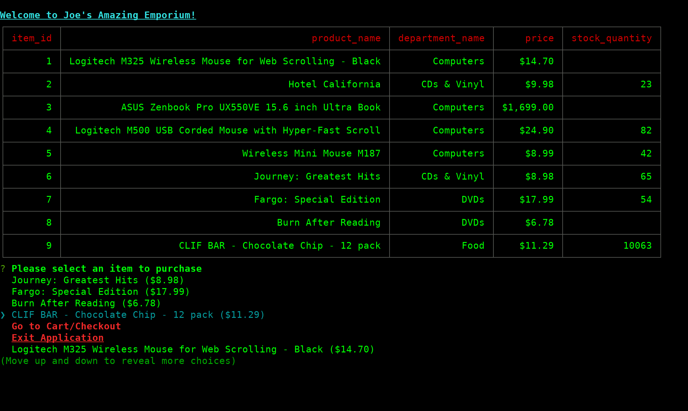
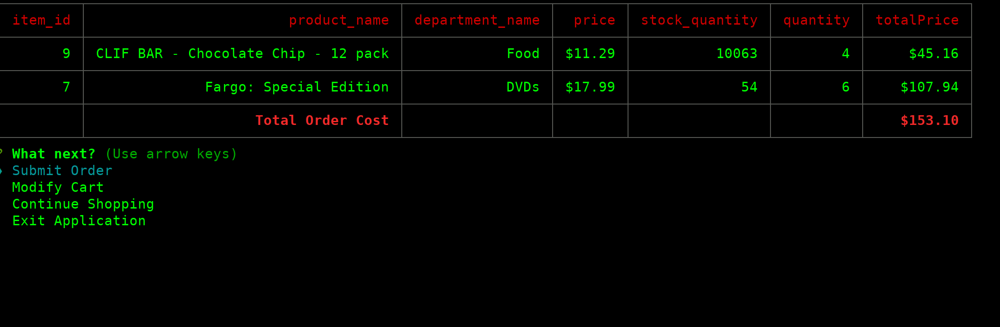
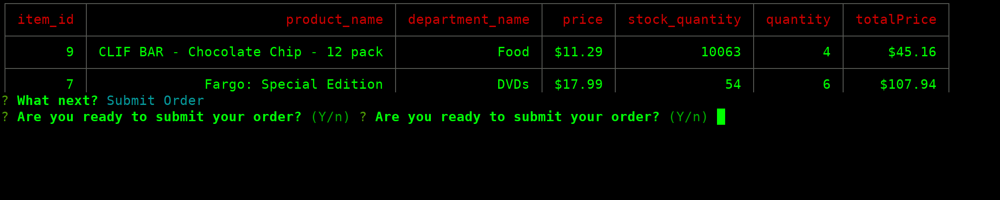
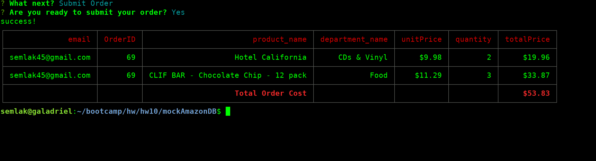

# mockAmazonDB


This is a basic Node console application for to interact with a toy amazon-like MySQL database.


## To Run:

clone github repo
```
git clone https://github.com/semlak/mockAmazonDB.git
cd mockAmazonDB
npm install
```

Before running, you need to setup the DB environment. You need mysql running.
The config information for the application to interacte with the database goes in a .env file, which you have to create.

example .env:
```
DBHOST='localhost'
DBPORT=3306
DBUSER='semlak'
DBPASSWD=''
```

You also need to initialize the database and seed it.
Assuming you have user access to mysql:
```
mysql < ./lib/bamazon.sql
mysql < ./lib/seed.sql
```

then you can run the application:
```
node bamazonCustomer

```

When ordering, you are not really warned if there is enough stock quantity to complete order, but the order will fail and your cart will return. This is enforced by the database, and the order submission uses the database transaction scheme, where an order is created, line items submitted, product quanitites reduced, and if this results in an invalid state for the database, the transaction is rolled back.

My database schema is as follows
```
dbName: bamazon

use bamazon;

products: (
	item_id (primary key)
	product_name
	department_name
	price
	stock_quantity
);

user (
	id (primary key)
	email
	role
)

user_order (
	id (primary key)
	user_id (foreign key to user)
)

line_item (
	id  (primary key)
	item_id (foreign key to products)
	order_id (foreign key to user_order)
	unit_price
	quantity
);
```

## While running, you have the following basic user flow:


### Welcome Screen



### Basice Login (no password, email doesn't need to even be a email address format)



### Select items to buy



### You have options while shopping



### View Cart


### When ready, submit your order



### Exits on order completion


